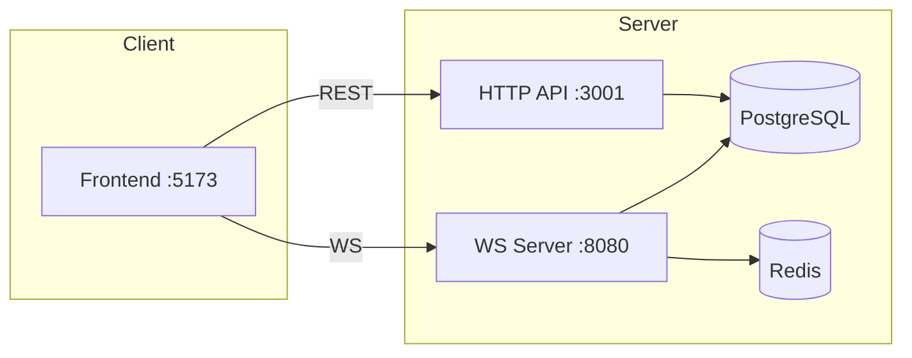
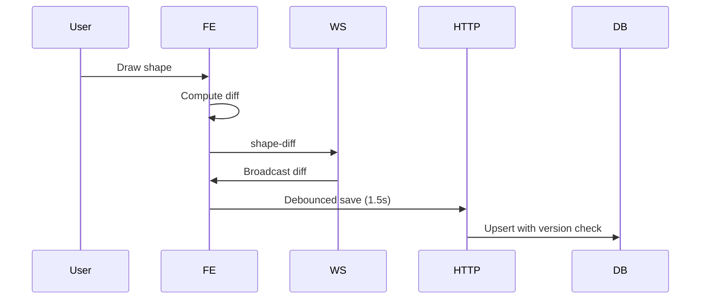

# nerdev-docs Skill

**Purpose**: Development-integrated documentation — docs that live with code, generate from code, evolve with code, and serve both humans and AI agents.

---

## Documentation Philosophy

**Documentation is not separate from development.** It's part of the same workflow:
- Written **before** or **during** implementation (not after)
- Generated **from** source of truth (code, schemas, configs)
- Versioned **with** code (same repo, same PR)
- Consumed **by** both humans and AI agents

---

## Required Document Types

### 1. AGENTS.md (AI Agent Guidance) — **MANDATORY**
Generated via `agent-docs-writer` skill. Every project root must have this.

```
project/
├── AGENTS.md          # ← AI agent onboarding (generated)
├── README.md          # ← Human onboarding
└── ...
```

### 2. Architecture Decision Records (ADRs)
**Location**: `docs/adr/YYYY-MM-DD-short-title.md`

```markdown
# ADR 001: Use TanStack Router over Next.js App Router

## Status
Accepted

## Context
Need file-based routing with type safety for canvas-heavy app.
Next.js SSR adds bundle overhead and hydration mismatches.

## Decision
Use Vite + TanStack Router for frontend.

## Consequences
- Smaller client bundle (~40% reduction)
- Type-safe routes with search param validation
- No SSR for canvas (client-only rendering)
- Migration path from Next.js documented

## References
- [TanStack Router vs Next.js](https://tanstack.com/router/latest/docs/framework/nextjs)
- PR #234: Frontend migration
```

**Template**: `docs/adr/template.md`

### 3. Design Docs (Pre-Implementation)
**Location**: `docs/design/feature-name.md`

```markdown
# Design: Real-time Cursor Sync

## Problem
Users need to see collaborators' cursors in real-time.

## Requirements
- <50ms latency local → remote
- Handle 50+ concurrent users per room
- Graceful degradation on reconnect

## Proposed Solution
```
User moves cursor
    → Throttled (16ms) WS message
    → Server broadcasts to room
    → Clients render with interpolation
    → Reconnect: full state sync
```

## Data Model
```typescript
interface CursorMessage {
  type: 'cursor';
  payload: {
    userId: string;
    userName: string;
    x: number;
    y: number;
    timestamp: number;
  };
}
```

## API Contract
- WS: `cursor` message type
- HTTP: `GET /api/rooms/:id/cursors` (initial load)

## Testing Strategy
- Unit: throttle, interpolation logic
- Integration: WS broadcast with 10 clients
- E2E: Two browsers, verify cursor visibility

## Rollout
- Feature flag: `FEATURE_CURSOR_SYNC`
- Canary: 10% of rooms
- Metrics: WS message rate, latency p95
```

### 4. Architecture Minimap (Visual Reference)
**Location**: `ARCHITECTURE_MINIMAP.md` (root)

```markdown
# Architecture Minimap

## System Overview


## Data Flow: Shape Persistence


## Service Map
| Service | Port | Protocol | Responsibility |
|---------|------|----------|----------------|
| Frontend | 5173 | HTTP/WS | Canvas, UI, Auth |
| HTTP API | 3001 | REST | Auth, Rooms, Shapes |
| WS Server | 8080 | WS | Real-time sync, Presence |
```

### 5. Feature Timeline / Changelog
**Location**: `docs/features.md`

```markdown
# Feature Timeline

## Phase 1: Bootstrap (Jan 2025)
- [x] Monorepo scaffolding (Turborepo + Bun)
- [x] HTTP + WS server skeletons
- [x] Frontend Vite + TanStack Router setup
- [x] Prisma schema + Neon connection

## Phase 2: Core Canvas (Jul 2025)
- [x] Canvas engine with Rough.js
- [x] Tools: Pencil, Rectangle, Ellipse, Arrow, Line, Text
- [x] Undo/Redo (delta-based, cap 100)
- [x] Export: PNG, SVG, JSON

## Phase 3: Auth & Rooms (Jul 2025)
- [x] Signup/Signin with bcrypt
- [x] Session cookies (httpOnly)
- [x] Room CRUD (create, join via slug)
- [x] Role-based access (owner, editor, viewer)

## Phase 4: Real-time Sync (Jul 2025)
- [x] WebSocket server (Bun.serve)
- [x] Diff-based broadcasting
- [x] Cursor sync with interpolation
- [x] Reconnection with full-state sync

## Phase 5: Production Hardening (Aug 2026)
- [x] Optimistic concurrency (version field)
- [x] CI/CD pipeline (GitHub Actions)
- [x] PM2 + Nginx deployment
- [x] Incident documentation process
```

### 6. Incident Postmortems
**Location**: `docs/incidents/YYYY-MM-DD-incident-name.md`

```markdown
# Incident: WebSocket Connection Storm (2026-08-15)

## Summary
WS server CPU hit 100%, 500+ connections dropped, 5min recovery.

## Timeline
- 14:22: Deploy v2.3.1 (new cursor throttling)
- 14:23: CPU spike observed
- 14:25: Alert fired (CPU > 80%)
- 14:27: Manual restart WS server
- 14:28: Service restored

## Root Cause
Cursor throttling used `setInterval` per connection instead of shared timer.
500 connections = 500 intervals = event loop saturation.

## Fix
```typescript
// Before (broken)
connection.on('cursor', () => {
  setInterval(sendCursor, 16); // Per connection!
});

// After (fixed)
const cursorBroadcaster = setInterval(() => {
  rooms.forEach(room => broadcastCursors(room));
}, 16);
```

## Prevention
- [x] Load test WS with 1000 connections
- [x] Add CPU/memory alerts per process
- [x] Code review checklist: no per-connection intervals
- [x] Document WS scaling limits in ARCHITECTURE_MINIMAP.md
```

### 7. Deployment Runbook
**Location**: `deploy.md` (root)

```markdown
# Deployment Runbook

## Prerequisites
- AWS EC2 (t3.small minimum)
- Neon PostgreSQL branch
- Domain + Certbot SSL

## First-Time Setup
```bash
# On EC2
sudo apt update && sudo apt install -y nginx certbot python3-certbot-nginx pm2
git clone https://github.com/nerdev-co/project.git
cd project
cp .env.example .env  # Fill in values
bun install
bun run build
pm2 start ecosystem.config.json
sudo nginx -t && sudo systemctl reload nginx
sudo certbot --nginx -d app.example.com
```

## Routine Deploy (via GitHub Actions)
1. Push to `main` → CI runs
2. On success → Deploy workflow triggers
3. Workflow: `scp dist/` → `bun install` → `prisma migrate deploy` → `pm2 reload all`

## Rollback
```bash
pm2 reload all --update-env  # If env changed
pm2 restart all              # Quick restart
git revert <commit> && push  # Code rollback
```

## Troubleshooting
| Symptom | Check | Fix |
|---------|-------|-----|
| 502 Bad Gateway | `pm2 list` | `pm2 restart all` |
| WS connection fails | `nginx error.log` | Check proxy_pass / upgrade headers |
| DB migration fails | `pm2 logs http-backend` | `prisma migrate resolve --rolled-back` |
```

### 8. API Contracts (Generated)
**Location**: `openapi.yaml` (root) + `asyncapi.yaml` (if event-driven)

```bash
# Generate from code
bun run openapi:gen    # From Elysia routes
bun run asyncapi:gen   # From event definitions
```

### 9. Contribution Guide
**Location**: `CONTRIBUTING.md` (root)

```markdown
# Contributing

## Development Setup
```bash
bun install
cp .env.example .env
docker compose up -d db redis
bunx prisma migrate dev
bun run dev
```

## Workflow
1. Create issue or pick existing
2. Branch: `feat/short-description` or `fix/short-description`
3. Write design doc (if new feature): `docs/design/feature.md`
4. Implement with tests
5. Update ADR if architecture decision
6. Update feature timeline
7. PR: description links issue + design doc
8. CI must pass (typecheck, lint, build, test)

## Code Standards
- camelCase files/functions, PascalCase types
- JSDoc on all exports
- No `any` — use `unknown` or proper types
- Shared code in `packages/`
- Diff-based WS sync (no full state)
```

---

## Generation Scripts (package.json)

```json
{
  "scripts": {
    "docs:gen": "bun run scripts/generate-docs.ts",
    "openapi:gen": "bun run scripts/generate-openapi.ts",
    "asyncapi:gen": "bun run scripts/generate-asyncapi.ts",
    "adr:new": "bun run scripts/new-adr.ts",
    "design:new": "bun run scripts/new-design.ts",
    "incident:new": "bun run scripts/new-incident.ts"
  }
}
```

### Generate ADR Script
```typescript
// scripts/new-adr.ts
const title = process.argv[2];
if (!title) {
  console.error('Usage: bun run adr:new "short title"');
  process.exit(1);
}
const date = new Date().toISOString().split('T')[0];
const slug = title.toLowerCase().replace(/[^a-z0-9]+/g, '-');
const filename = `docs/adr/${date}-${slug}.md`;
const template = await Bun.file('docs/adr/template.md').text();
const content = template
  .replace('{{TITLE}}', title)
  .replace('{{DATE}}', date)
  .replace('{{NUMBER}}', String(await getNextAdrNumber()).padStart(3, '0'));
await Bun.write(filename, content);
console.log(`Created ${filename}`);
```

### Generate Design Doc Script
```typescript
// scripts/new-design.ts
const feature = process.argv[2];
if (!feature) {
  console.error('Usage: bun run design:new "feature name"');
  process.exit(1);
}
const filename = `docs/design/${feature.toLowerCase().replace(/\s+/g, '-')}.md`;
const template = await Bun.file('docs/design/template.md').text();
await Bun.write(filename, template.replace('{{FEATURE}}', feature));
console.log(`Created ${filename}`);
```

---

## Documentation Linting

```yaml
# .github/workflows/docs.yml
jobs:
  docs-lint:
    runs-on: ubuntu-latest
    steps:
      - uses: actions/checkout@v4
      - uses: oven-sh/setup-bun@v1
      - run: bun install
      - run: bun run docs:lint  # markdownlint + link check

  docs-generate:
    runs-on: ubuntu-latest
    needs: docs-lint
    steps:
      - uses: actions/checkout@v4
      - uses: oven-sh/setup-bun@v1
      - run: bun install
      - run: bun run docs:gen
      - run: bun run openapi:gen
      - uses: actions/upload-artifact@v4
        with:
          name: generated-docs
          path: docs/generated/
```

### Markdown Lint Config
```json
// .markdownlint.json
{
  "MD013": false,  // Line length
  "MD024": { "siblings_only": true },  // Duplicate headings
  "MD033": false,  // Inline HTML (for Mermaid)
  "MD041": false   // First line heading
}
```

---

## AI-Agent Consumption Patterns

### AGENTS.md Structure (from agent-docs-writer)
```markdown
# AGENTS.md

## Project Overview
One-paragraph summary + architecture diagram.

## Quick Start
Commands to run dev, build, test.

## Key Conventions
- Naming, file structure, patterns

## Common Tasks
- "Add a new tool" → steps + files to touch
- "Add API endpoint" → steps + files to touch
- "Debug WS issue" → logs + endpoints

## Architecture Map
Mermaid diagram + service table.

## Gotchas
- "Don't import Prisma directly in routes"
- "WS messages must be discriminated unions"
```

### Code Annotations for AI
```typescript
/**
 * @ai-context This is the main canvas rendering loop.
 * @ai-side-effect Mutates `dirtyRegions` for partial redraw.
 * @ai-related-files packages/core/interfaces/tool.ts, apps/frontend/src/draw/tools/*
 */
export function renderFrame(context: RenderContext): void {
  // ...
}
```

---

## Documentation Checklist per PR

- [ ] **New feature?** → Design doc in `docs/design/`
- [ ] **Architecture decision?** → ADR in `docs/adr/`
- [ ] **API change?** → `bun run openapi:gen` updated
- [ ] **Event change?** → `bun run asyncapi:gen` updated
- [ ] **Breaking change?** → Changelog entry + migration guide
- [ ] **Incident occurred?** → Postmortem in `docs/incidents/`
- [ ] **Deploy process changed?** → `deploy.md` updated
- [ ] **Onboarding info missing?** → `AGENTS.md` / `README.md` updated

---

## Tooling

| Tool | Purpose |
|------|---------|
| `markdownlint` | Lint markdown files |
| `markdown-link-check` | Verify links |
| `mermaid-cli` | Render diagrams in CI |
| `typedoc` | Generate API docs from JSDoc |
| `openapi-generator` | Generate clients from OpenAPI |
| `asyncapi-generator` | Generate code from AsyncAPI |

---

## Integration with Other Skills

| Skill | Provides |
|-------|----------|
| `nerdev-monorepo` | Repo structure, required files list |
| `nerdev-abstraction` | Interface docs, plugin protocol docs |
| `agent-docs-writer` | `AGENTS.md` generation |
| `this skill` | All other docs + generation scripts |

---

## Quick Start for New Projects

```bash
# 1. Scaffold docs structure
mkdir -p docs/adr docs/design docs/incidents docs/generated

# 2. Copy templates
cp ~/.config/opencode/skills/nerdev-docs/templates/* docs/

# 3. Add scripts to package.json
# (see Generation Scripts above)

# 4. Create first ADR
bun run adr:new "Initial architecture decisions"

# 5. Create first design doc
bun run design:new "Core domain model"

# 6. Generate AGENTS.md
skill agent-docs-writer
# Follow prompts
```

---

## Templates Location

```
~/.config/opencode/skills/nerdev-docs/templates/
├── adr-template.md
├── design-template.md
├── incident-template.md
├── contributing-template.md
└── deploy-template.md
```