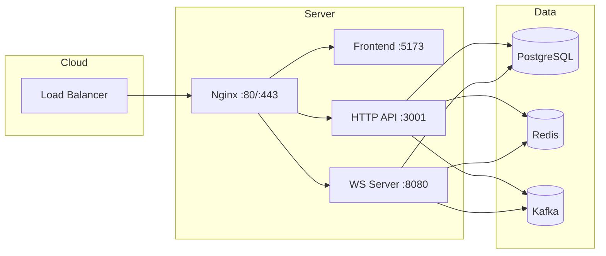

# Deployment Guide: {{PROJECT_NAME}}

## Architecture Overview


## Prerequisites

### Infrastructure
- [ ] Server: Ubuntu 22.04+ (t3.small minimum)
- [ ] Domain name with DNS configured
- [ ] PostgreSQL: Neon / managed / self-hosted
- [ ] Redis: Managed / self-hosted
- [ ] Kafka: Managed / self-hosted (if needed)

### Local Tools
- [ ] `bun` 1.2+
- [ ] `pm2` globally
- [ ] `nginx` + `certbot`
- [ ] `docker` (for local dev only)

## First-Time Server Setup

```bash
# 1. Update system
sudo apt update && sudo apt upgrade -y

# 2. Install runtime dependencies
sudo apt install -y nginx certbot python3-certbot-nginx postgresql-client redis-tools

# 3. Install Bun
curl -fsSL https://bun.sh/install | bash
source ~/.bashrc

# 4. Install PM2 globally
bun add -g pm2

# 5. Configure firewall
sudo ufw allow 22/tcp
sudo ufw allow 80/tcp
sudo ufw allow 443/tcp
sudo ufw enable

# 6. Create deploy user (optional)
sudo adduser deploy
sudo usermod -aG sudo deploy
```

## Application Deployment

### 1. Clone Repository
```bash
cd /opt
sudo git clone https://github.com/{{ORG}}/{{REPO}}.git
sudo chown -R $USER:$USER {{REPO}}
cd {{REPO}}
```

### 2. Configure Environment
```bash
cp .env.example .env
# Edit .env with production values:
# - DATABASE_URL (Neon connection string)
# - REDIS_URL
# - KAFKA_BROKERS
# - JWT_SECRET (generate: openssl rand -base64 32)
# - ALLOWED_ORIGINS (https://yourdomain.com)
# - NODE_ENV=production
```

### 3. Install & Build
```bash
bun install
bun run build
```

### 4. Database Migration
```bash
# Run migrations
bunx prisma migrate deploy --schema packages/db/schema.prisma

# Verify
bunx prisma db pull --schema packages/db/schema.prisma
```

### 5. PM2 Process Configuration
Create `ecosystem.config.json`:
```json
{
  "apps": [
    {
      "name": "{{REPO}}-http",
      "cwd": "./apps/http-backend",
      "script": "dist/index.js",
      "instances": 2,
      "exec_mode": "cluster",
      "env": {
        "NODE_ENV": "production",
        "PORT": 3001
      },
      "error_file": "/var/log/pm2/{{REPO}}-http-error.log",
      "out_file": "/var/log/pm2/{{REPO}}-http-out.log",
      "log_date_format": "YYYY-MM-DD HH:mm:ss Z",
      "max_memory_restart": "500M",
      "restart_delay": 3000
    },
    {
      "name": "{{REPO}}-ws",
      "cwd": "./apps/ws-backend",
      "script": "dist/index.js",
      "instances": 1,
      "exec_mode": "fork",
      "env": {
        "NODE_ENV": "production",
        "PORT": 8080
      },
      "error_file": "/var/log/pm2/{{REPO}}-ws-error.log",
      "out_file": "/var/log/pm2/{{REPO}}-ws-out.log",
      "log_date_format": "YYYY-MM-DD HH:mm:ss Z",
      "max_memory_restart": "500M"
    }
  ]
}
```

```bash
# Create log directory
sudo mkdir -p /var/log/pm2
sudo chown $USER:$USER /var/log/pm2

# Start processes
pm2 start ecosystem.config.json
pm2 save
pm2 startup  # Follow instructions to enable on boot
```

### 6. Nginx Configuration
Create `/etc/nginx/sites-available/{{REPO}}`:
```nginx
upstream frontend {
    server localhost:5173;
    keepalive 32;
}

upstream http_backend {
    server localhost:3001;
    keepalive 32;
}

upstream ws_backend {
    server localhost:8080;
    keepalive 32;
}

server {
    listen 80;
    server_name {{DOMAIN}};
    
    # Redirect to HTTPS
    return 301 https://$server_name$request_uri;
}

server {
    listen 443 ssl http2;
    server_name {{DOMAIN}};
    
    ssl_certificate /etc/letsencrypt/live/{{DOMAIN}}/fullchain.pem;
    ssl_certificate_key /etc/letsencrypt/live/{{DOMAIN}}/privkey.pem;
    ssl_protocols TLSv1.2 TLSv1.3;
    ssl_ciphers HIGH:!aNULL:!MD5;
    
    # Security headers
    add_header X-Frame-Options DENY;
    add_header X-Content-Type-Options nosniff;
    add_header X-XSS-Protection "1; mode=block";
    add_header Referrer-Policy strict-origin-when-cross-origin;
    
    # Frontend
    location / {
        proxy_pass http://frontend;
        proxy_http_version 1.1;
        proxy_set_header Upgrade $http_upgrade;
        proxy_set_header Connection "upgrade";
        proxy_set_header Host $host;
        proxy_set_header X-Real-IP $remote_addr;
        proxy_set_header X-Forwarded-For $proxy_add_x_forwarded_for;
        proxy_set_header X-Forwarded-Proto $scheme;
        proxy_cache_bypass $http_upgrade;
        
        # Static asset caching
        location ~* \.(js|css|png|jpg|jpeg|gif|ico|svg|woff|woff2)$ {
            expires 1y;
            add_header Cache-Control "public, immutable";
        }
    }
    
    # HTTP API
    location /api/ {
        proxy_pass http://http_backend;
        proxy_http_version 1.1;
        proxy_set_header Host $host;
        proxy_set_header X-Real-IP $remote_addr;
        proxy_set_header X-Forwarded-For $proxy_add_x_forwarded_for;
        proxy_set_header X-Forwarded-Proto $scheme;
        proxy_read_timeout 60s;
        proxy_send_timeout 60s;
    }
    
    # WebSocket
    location /ws/ {
        proxy_pass http://ws_backend;
        proxy_http_version 1.1;
        proxy_set_header Upgrade $http_upgrade;
        proxy_set_header Connection "upgrade";
        proxy_set_header Host $host;
        proxy_set_header X-Real-IP $remote_addr;
        proxy_set_header X-Forwarded-For $proxy_add_x_forwarded_for;
        proxy_set_header X-Forwarded-Proto $scheme;
        proxy_read_timeout 86400;
        proxy_send_timeout 86400;
    }
    
    # Health checks (no auth)
    location /health {
        proxy_pass http://http_backend/api/health;
        access_log off;
    }
}
```

Enable site:
```bash
sudo ln -s /etc/nginx/sites-available/{{REPO}} /etc/nginx/sites-enabled/
sudo nginx -t
sudo systemctl reload nginx
```

### 7. SSL Certificate
```bash
sudo certbot --nginx -d {{DOMAIN}} --non-interactive --agree-tos -m admin@{{DOMAIN}}
# Auto-renewal
sudo systemctl enable certbot.timer
```

### 8. Verify Deployment
```bash
# Check all services
pm2 list
curl -f https://{{DOMAIN}}/health
curl -f https://{{DOMAIN}}/api/health
# WebSocket test (requires wscat)
wscat -c wss://{{DOMAIN}}/ws/
```

## Routine Deployment (Automated via GitHub Actions)

### Trigger
Push to `main` branch → CI passes → Deploy workflow runs

### Workflow Steps
1. **Build artifact**: `bun run build` → upload `apps/frontend/dist`
2. **SSH to server**: Pull latest code
3. **Install deps**: `bun install --production`
4. **Run migrations**: `bunx prisma migrate deploy`
5. **Reload PM2**: `pm2 reload all`
6. **Health check**: Verify endpoints
7. **Notify**: Slack/Discord on success/failure

### Manual Deploy (Emergency)
```bash
cd /opt/{{REPO}}
git pull origin main
bun install
bun run build
bunx prisma migrate deploy
pm2 reload all
```

## Rollback Procedures

### Code Rollback
```bash
# Option 1: Git revert (preferred)
git revert <bad-commit>
git push origin main  # Triggers deploy

# Option 2: Direct checkout (emergency)
git checkout <good-tag>
bun run build
pm2 reload all
```

### Database Rollback
```bash
# List migrations
bunx prisma migrate status

# Rollback last migration
bunx prisma migrate resolve --rolled-back "<migration_name>"

# Or restore from backup (Neon: Point-in-time recovery)
```

### Config Rollback
```bash
# Restore previous .env
cp .env.backup .env
pm2 reload all --update-env
```

## Monitoring & Alerting

### Health Endpoints
| Endpoint | Service | Expected |
|----------|---------|----------|
| `GET /health` | HTTP API | 200 OK |
| `GET /api/health` | HTTP API | 200 + DB/Redis status |
| `GET /ws/health` | WS Server | 200 OK |

### Key Metrics
| Metric | Warning | Critical |
|--------|---------|----------|
| CPU (per process) | >70% | >90% |
| Memory (per process) | >400MB | >450MB |
| WS Connections | >800 | >1000 |
| HTTP Latency p95 | >500ms | >1s |
| DB Connections | >80% pool | >95% pool |
| Error Rate | >1% | >5% |

### Log Locations
```bash
# PM2 logs
pm2 logs {{REPO}}-http
pm2 logs {{REPO}}-ws

# Nginx logs
sudo tail -f /var/log/nginx/access.log
sudo tail -f /var/log/nginx/error.log

# Application logs (structured JSON)
tail -f /var/log/pm2/{{REPO}}-http-out.log | jq .
```

## Troubleshooting

| Symptom | Diagnosis | Resolution |
|---------|-----------|------------|
| 502 Bad Gateway | PM2 process down | `pm2 list`, `pm2 restart all` |
| WS connection fails | Nginx upgrade headers | Check `/ws/` location config |
| DB connection pool exhausted | Prisma client not singleton | Verify `packages/db/src/client.ts` |
| High memory | WS connection leak | Check `connection` event cleanup |
| Slow queries | Missing indexes | `EXPLAIN ANALYZE`, add indexes |
| Cert renewal fails | Certbot timer stopped | `systemctl restart certbot.timer` |

## Backup & Disaster Recovery

### Database
- **Neon**: Automatic PITR (7-day retention), manual branches
- **Self-hosted**: Daily `pg_dump` to S3, test restore monthly

### Application State
- **Config**: `.env` backed up to parameter store / 1Password
- **Code**: Git history (source of truth)
- **Uploads**: S3 / object storage (not local disk)

### Recovery Time Objectives
| Scenario | RTO | RPO |
|----------|-----|-----|
| Single service restart | 2 min | 0 |
| Full server rebuild | 30 min | 0 (git) |
| Database restore | 15 min | 1 hour |
| Region failover | 1 hour | 5 min (Neon) |

## Security Checklist
- [ ] Non-root user for PM2 processes
- [ ] SSH key-only access, no passwords
- [ ] Fail2ban on SSH
- [ ] Nginx rate limiting on `/api/auth/*`
- [ ] CSP headers configured
- [ ] Secrets in environment, never in code
- [ ] Regular dependency scans (`bun audit`)
- [ ] Database SSL required
- [ ] Redis AUTH enabled
- [ ] Kafka SASL/SSL enabled

## Maintenance Windows
- **Weekly**: Dependency updates (Monday 02:00 UTC)
- **Monthly**: Security patches, cert renewal check
- **Quarterly**: Load test, disaster recovery drill

## Contacts
| Role | Name | Contact |
|------|------|---------|
| Primary On-call |  |  |
| Secondary On-call |  |  |
| Database Admin |  |  |
| Infrastructure |  |  |

---
*Last updated: {{DATE}}*
*Review quarterly*