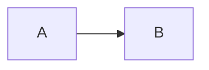

# Design: {{FEATURE}}

## Problem
What problem are we solving? Why now?

## Requirements
### Functional
- 

### Non-Functional
- Performance: 
- Scalability: 
- Reliability: 
- Security: 

## Current State
How does it work today? What are the limitations?

## Proposed Solution
### High-Level Architecture


### Data Model
```typescript
interface NewEntity {
  id: string;
  // ...
}
```

### API Contract
#### HTTP
- `METHOD /path` - Description

#### WebSocket
- `message-type` - Description

### Algorithm / Logic
Key algorithms, state machines, or business logic.

### Error Handling
| Scenario | Response | Recovery |
|----------|----------|----------|

## Implementation Plan
### Phase 1: Foundation
- [ ] Task 1
- [ ] Task 2

### Phase 2: Core Feature
- [ ] Task 3
- [ ] Task 4

### Phase 3: Polish
- [ ] Task 5
- [ ] Task 6

## Testing Strategy
### Unit Tests
- 

### Integration Tests
- 

### E2E Tests
- 

### Load/Chaos Tests
- 

## Rollout Plan
- Feature flag: 
- Canary percentage: 
- Metrics to watch: 
- Rollback criteria: 

## Operational Considerations
- Logging: 
- Monitoring: 
- Alerting: 
- Runbook updates: 

## Security Considerations
- 

## Privacy Considerations
- 

## Accessibility Considerations
- 

## Future Extensions
- 

## Open Questions
- 

---
*Status: Draft | Review | Approved | Implemented*
*Author: *
*Reviewers: *
*Created: {{DATE}}*